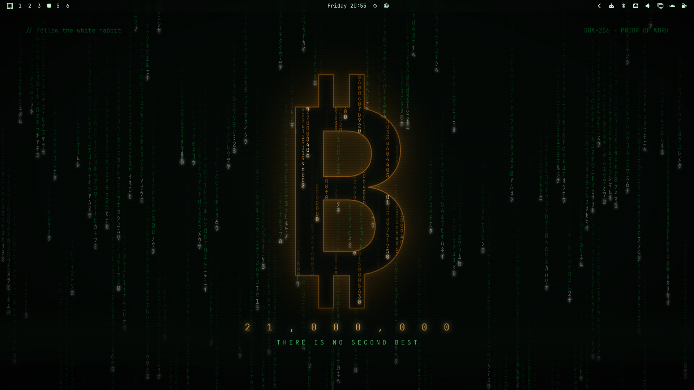
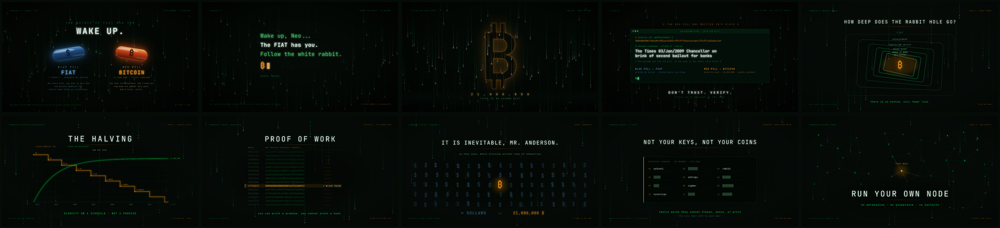
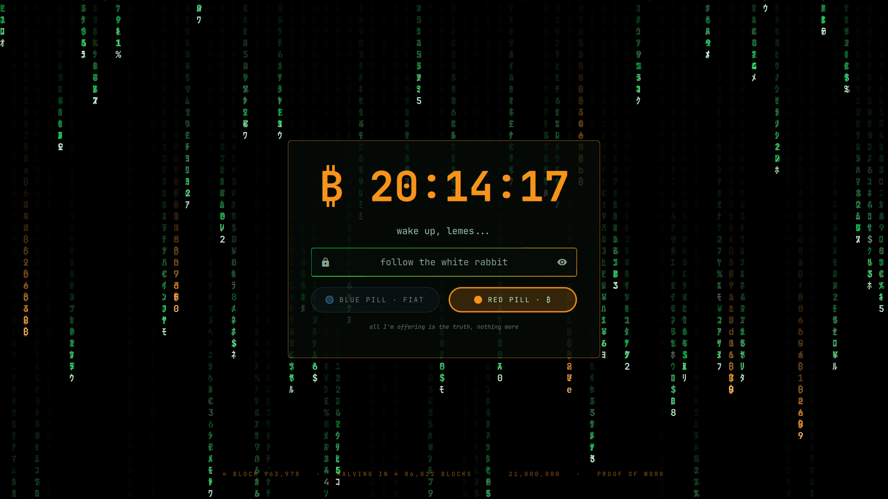

# Red Pill

A Matrix-meets-Bitcoin theme for [Omarchy](https://omarchy.org).

The green code rain is the fiat illusion you were born into. Bitcoin orange is
the way out. The palette makes that argument on every surface: green is the
system you woke up in, `#f7931a` is the accent you chose.



## Install

```sh
omarchy theme install https://github.com/ferlemes/omarchy-red-pill-theme.git
```

Or, from the Omarchy menu (`Super + Space`): *Install > Style > Theme*, then
paste the repo URL.

## What's in it

- **Palette** built around Bitcoin orange over a near-black matrix green, with
  a green-to-orange Hyprland border gradient that carries the same idea into
  window focus, notifications and the lock screen input.
- **10 wallpapers** at 3840x2160.
- **ASCII screensaver** — `₿ WAKE UP · FIAT IS THE MATRIX · 21,000,000 ₿`.
- **An optional lock screen design** (see below).





| Role | Color |
|---|---|
| accent | `#f7931a` |
| background | `#050b07` |
| foreground | `#c8f5d4` |
| green | `#00d94a` |
| red | `#ff4d2e` |
| active border | `rgba(00d94aee) → rgba(f7931aee)` at 45° |

## The lock screen

Optional, and not installed by the theme — it needs the
[Lock Screen Explorer](https://github.com/SirJul1337/omarchy-lock-explorer)
plugin, which replaces Omarchy's built-in lock service with one that can load
custom designs:

```sh
omarchy plugin add https://github.com/SirJul1337/omarchy-lock-explorer.git --enable
omarchy restart shell

cp ~/.config/omarchy/themes/red-pill/lock-designs/RedPill.qml ~/.config/omarchy/lock-designs/
omarchy-shell lock rescanDesigns
omarchy-shell lock setDesign my-redpill
```

What it does:

- Matrix rain where the green columns carry katakana, digits and the currencies
  that get printed, while roughly one column in eight falls in Bitcoin orange,
  dropping hash digits with a ₿ surfacing at the head.
- **The choice.** Two pills under the password field. Red is the default. Take
  the blue one and the whole screen goes back to the illusion: cold blue rain,
  no bitcoin, `$` on the clock, "sleep well" instead of "wake up", and a footer
  that promises infinite supply and proof of trust. Both pills unlock the same
  way — nothing about authentication changes.
- An offline block-height estimate in the footer, anchored on block 840,000
  (the 2024 halving) at one block per ten minutes. It is an estimate, hence the
  `≈`; the lock screen makes no network requests.

Every color it uses comes from the active theme, so it follows along if you
tweak `colors.toml`.

## Credits

The Matrix is Warner Bros.' film; this is only a palette that admires it.
Bitcoin orange is `#f7931a` because it always was.

## License

MIT — see [LICENSE](LICENSE).
